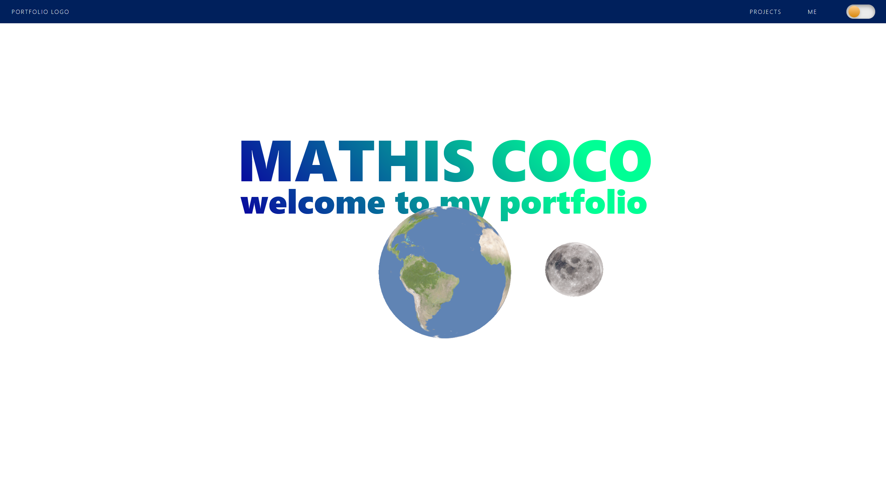

# Welcome to my personal porfolio in ReactJS

Hey 👋 In this repo you will find my professional and personal experiences, my projects, CV, and more.

I'm currently using ThreeJS for 3d models and plan to add more cool stuff in the future !

Here are some pics of my current advancement in this project:

# Getting Started with Create React App
## Available Scripts

In the project directory, you can run:

### `npm start`

Runs the app in the development mode.\
Open [http://localhost:3000](http://localhost:3000) to view it in your browser.

## Learn More

You can learn more in the [Create React App documentation](https://facebook.github.io/create-react-app/docs/getting-started).

To learn React, check out the [React documentation](https://reactjs.org/).

### Deployment

This section has moved here: [https://facebook.github.io/create-react-app/docs/deployment](https://facebook.github.io/create-react-app/docs/deployment)
